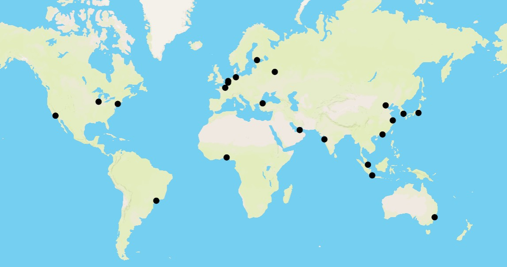

# Backend

## Route Calculation

The optimal routes are calculated using Dijkstras algorithm. For this there is a graph stored in `route-calculation/graph.js` that has all the possible direct routes using different transportation methods between the predefined locations. These direct routes are calculated by `route-calculation/build-graph` by going through all of the locations and making routes to all other locations that support the same transportation method. The direct routes for the specific transportation methods are formed using the functions in `route-calculation/find-routes.js`.

The locations are defined in `data/locations.geojson`. These are some of the biggest transportation hubs around the world.

If the start or the end point of the requested route is not one of the predefined locations, new truck routes are added to the graph between that location and the predefined locations. The same `findTruckRoutes` function used in generating the graph is used for calculating these routes. The function only makes an api call to get routes for locations that are within the distance specified by the `maxDistance` parameter to make the route calculation faster.


### Locations

The currently included locations.


### How to Generate the Graph

If you make modifications to the code (`build-graph.js` or `find-routes.js`) or the location files in the `data/`, you need to run the script to repopulate the database.

If you added new locations run this in the backend root to add the locations:
```
node route-calculation/build-graphs.js
```
If you made modifications to the code run the script with the `--clear` flag (DON'T DO THIS UNNECESSARILY, this will completely reset the database and take a very long time):
```
node route-calculation/build-graphs.js --clear
```


## Setup & Run the Project

### 1. Install Dependencies

Make sure you have [Node.js](https://nodejs.org/en) installed. Then, run:
```
npm install
```
Install `searoute` python library.
```
pip install searoute
```

### 2. Add Local Environment Variables

Make a new file called `.env` in the `backend` directory. This file will be ignored by git. Then add the following:

```
MAPBOX_API_TOKEN=yourapitoken
DATABASE_URL=databaseurl
DATABASE_KEY=databasekey
```

### 3. Start the Development Server

Run the following command to start the server locally:
```
npm run dev
```
By default, the server runs on http://localhost:3000.
